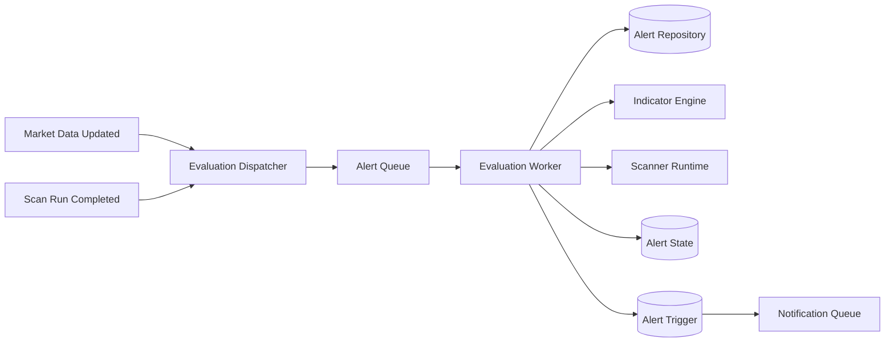

# ARCH-006 — Alert Evaluation Runtime

**Durum:** Uygulamaya hazır

## Temel kararlar

- Dispatcher ilgili alarm adaylarını instrument/timeframe/source indeksleriyle seçer.
- Evaluation identity: `alertId + revision + sourceEventId + cutoff`.
- State için PostgreSQL kaynaktır; Redis yalnız optimizasyon olabilir.
- Saved scan alarmı ortak Scanner Runtime kullanır.
- Worker kesintisi sonrası catch-up yapılır; notification flood engellenir.
- Deterministic invalid alarm retry edilmez; geçici altyapı hatası retry edilir.
