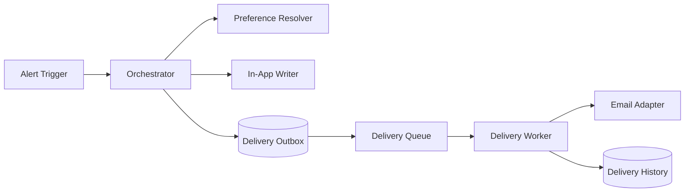

# ARCH-007 — Notification Delivery Runtime

**Durum:** Uygulamaya hazır

## İlkeler

- In-app notification ve dış delivery ayrıdır.
- Dış kanallar DB outbox üzerinden güvenilir biçimde gönderilir.
- Queue at-least-once olabilir; delivery idempotency duplicate'i engeller.
- Template code/version ve locale saklanır.
- Quiet hours delivery zamanını erteler.
- Provider secret ve ham yanıt loglanmaz.
