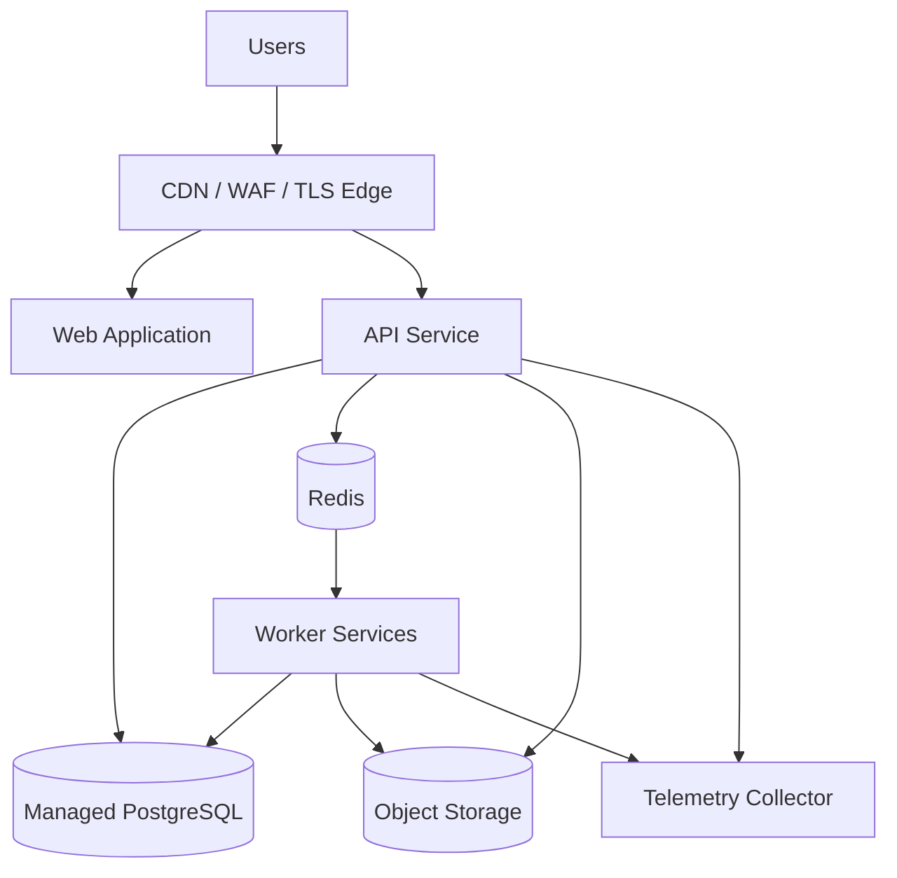

# ARCH-016 — Production Deployment Topology

**Durum:** Uygulamaya hazır

## İlkeler

- API ve worker ayrı ölçeklenebilir.
- Aynı immutable image farklı process role ile çalışabilir veya ayrı image'lar version-locked olabilir.
- PostgreSQL ve object storage kalıcı kaynaklardır.
- Redis kaybı doğruluk kaybı üretmez.
- Edge TLS, request limits ve WAF benzeri kontroller sağlar.
- Telemetry failure uygulama doğruluğunu etkilemez.
- Provider-specific resource isimleri IaC adapter katmanında kalır.

## Network

- DB/Redis public erişime kapalı,
- least-privilege security groups,
- outbound allowlist, mümkünse,
- admin/ops endpoint ayrı koruma,
- health endpoint güvenli.

## Scaling

- API CPU/latency,
- worker queue lag,
- memory-heavy backtest workers ayrı pool,
- scheduled jobs singleton/leader-safe.

## Deployment

- immutable digest,
- startup/readiness/liveness,
- graceful drain,
- migration job,
- rollback,
- version compatibility.
