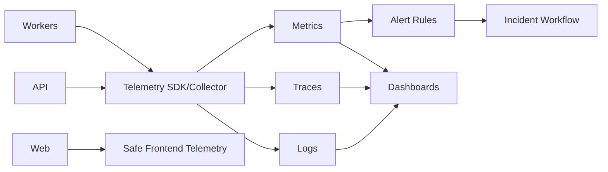

# ARCH-017 — Observability and Incident Runtime

**Durum:** Uygulamaya hazır

## İlkeler

- OpenTelemetry-compatible abstraction tercih edilir.
- Business metric ve infrastructure metric ayrılır.
- Metric label cardinality sınırlıdır.
- Trace context HTTP ve queue job üzerinden taşınır.
- Log redaction merkezi ve testlidir.
- Alert rule source controlled/versioned olabilir.
- Runbook linki olmayan kritik alert kabul edilmez.
