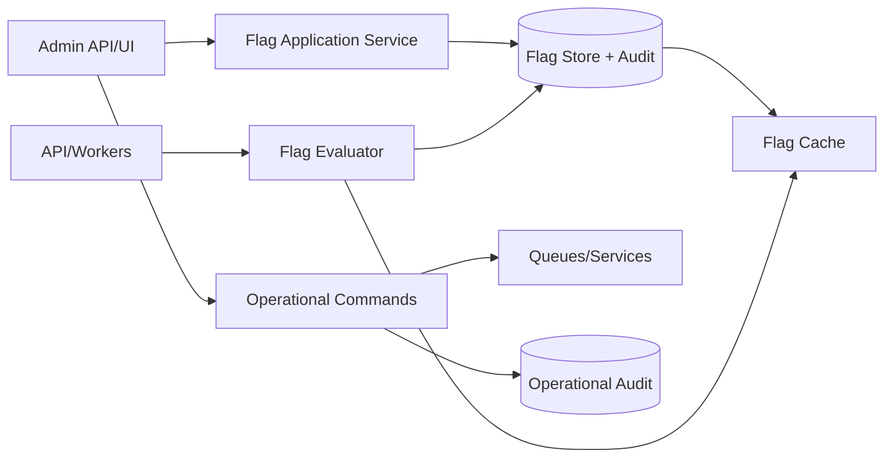

# ARCH-018 — Feature Flag and Operational Control Runtime

**Durum:** Uygulamaya hazır

## İlkeler

- PostgreSQL authoritative flag store olabilir.
- Cache kaybında güvenli default ve DB fallback uygulanır.
- Flag evaluation request path'te bounded olmalıdır.
- Kill switch kontrolleri job create ve worker execution noktalarında policy'ye göre uygulanır.
- Admin command arbitrary code veya raw queue payload çalıştırmaz.
- Her değişiklik auditlidir.
